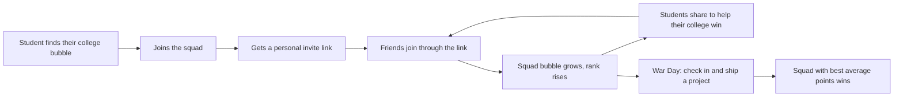

# NxtWave Arena

**Build. Compete. Ship.**

A college-vs-college growth game for a free workshop. Every college is a bubble in a live arena. Each student who joins makes their college's bubble bigger, and the squad whose members actually **show up and ship a project** wins.

> Live demo: `https://nxt-wave-arena.vercel.app/`

---

## Why this exists

Free workshops have two growth problems:

1. **Students have no reason to share them.** "Join this workshop" is not something people forward to friends.
2. **Registered does not mean attended.** Most sign-up counts hide a large no-show rate.

NxtWave Arena turns the workshop into a competition between colleges, so sharing becomes "help my college win", and it scores the things that actually matter: attendance and shipped projects, not only registrations.

It was built for the NxtWave Growth Challenge: get 500 final-year engineering students to register for the free workshop *Build Your First AI Project in 60 Minutes*.

---

## How it works



### Two phases

| Phase | What happens | How squads are ranked |
|---|---|---|
| **Recruit phase** (the campaign week) | Students join their college squad and invite friends | Number of sign-ups |
| **War Day** (the live workshop) | Students check in with a live code and submit their project link | Average points per member |

The organiser flips the switch from the admin page. When the bootcamp ends, the season is closed, winners go to the **Hall of Fame**, and the arena resets for the next season.

### Points

| Action | Points |
|---|---|
| Join a squad | +2 |
| A friend joins through your invite link | +1 (to you) |
| Start a college squad and become Captain | +3 (once) |
| Show up on War Day | +3 |
| Ship your project with a live link | +5 |

A student who joins, shows up and ships earns **10 points**.

### Winning

- **Squad score = average points per member.** This keeps big colleges from winning just by size, so a small college with an active squad can beat a large one.
- A squad needs a minimum number of members to be ranked on War Day (default 5, configurable).
- Inside a squad, members are ranked by **how many friends they invited**.
- The first person to join a college becomes its **Captain**.

---

## Features

- **Bubble arena landing page.** Bubble size follows member count and re-packs as squads grow. Hover a bubble to see joined, showed up, shipped, average points, rank and Captain. Click to enter the squad. Search dims non-matching colleges.
- **Add your own college.** If a college is missing, a student can start its squad. Duplicate and near-duplicate names are blocked so classmates land in one squad.
- **Personal dashboard.** Points, rank, how many more sign-ups or points are needed to pass the squad above, invite link with WhatsApp share, and quests for check-in and shipping.
- **Squad page.** Captain, rank, league, stats, and a leaderboard of members by invites.
- **Leaderboard.** Animated standings that switch metric between Recruit phase and War Day.
- **How it works widget.** A pop-up with all rules, always one click away.
- **Admin controls.** Start War Day, return to Recruit phase, and close the season, all behind a passcode.
- **Hall of Fame.** Grand Champion, most sign-ups, top recruiter and season totals are saved when a season closes.
- **Game-style UI.** Sticker-style cards, wipe transitions between pages, count-up numbers, confetti on joining, and respect for reduced-motion settings.

---

## Tech stack

| Layer | Choice |
|---|---|
| Frontend | React 18 + Vite 5 |
| Backend and database | Supabase (Postgres + SQL functions) |
| Hosting | Vercel (or any static host) |
| Styling | Plain CSS, Newsreader font from Google Fonts |

There are no runtime dependencies beyond React and `@supabase/supabase-js`.

---

## Architecture and security

The browser never reads or writes database tables directly. Row Level Security is enabled on every table with **no policies**, so the public key cannot touch the tables. All access goes through SQL functions that run with `security definer` and validate their inputs.

| Function | Purpose |
|---|---|
| `get_arena` | Returns phase, season, colleges, members (without phone numbers) and the Hall of Fame |
| `join_arena` | Joins a college. The first member becomes Captain. Records the inviter |
| `create_college` | Creates a new college squad and joins the creator as Captain |
| `login_arena` | Signs a returning member in by phone number |
| `check_in` | Marks attendance, only on War Day and only with the correct workshop code |
| `ship_project` | Marks a project shipped, only on War Day, only after check-in, only for an `https://` link |
| `admin_phase` | Switches between Recruit and War Day (passcode required) |
| `admin_close_season` | Saves the Hall of Fame, archives members, starts the next season (passcode required) |

The workshop code and admin passcode live in a `settings` table that the browser cannot read.

### Data model

| Table | Holds |
|---|---|
| `settings` | Phase, season, workshop code, admin passcode |
| `colleges` | Squads (id, name, city, optional logo link) |
| `members` | Builders (college, name, unique phone, Captain flag, inviter, attended, shipped, project link) |
| `members_archive` | Members from closed seasons |
| `hall` | Hall of Fame record per season |

The page polls `get_arena` every 8 seconds, so changes appear within a few seconds.

---

## Project structure

```
nxtwave-arena/
├── index.html
├── package.json
├── vite.config.js
├── .env.example
├── supabase/
│   └── schema.sql        # tables, security, 5 starting colleges, all functions
└── src/
    ├── main.jsx          # entry point
    ├── App.jsx           # all screens: arena, squad, dashboard, leaderboard, admin, rules
    ├── api.js            # Supabase client and RPC helper
    ├── store.js          # scoring rules and derived stats
    └── styles.css        # theme and animations
```

---

## Getting started

### Prerequisites

- Node.js 18 or newer
- A free [Supabase](https://supabase.com) account
- A free [Vercel](https://vercel.com) account (for deployment)

### 1. Set up the database

1. Create a new Supabase project.
2. Open `supabase/schema.sql` and change two values near the top:
   - `workshop_code`: the code you will show live during the workshop
   - `admin_pass`: your private admin passcode
3. In Supabase, open **SQL Editor**, paste the whole file, and click **Run**.
4. Go to **Project Settings > API** and copy the **Project URL** and the **anon / publishable key**.

The schema starts with 5 colleges and zero members. Edit the list in `schema.sql` before running it to use different colleges.

### 2. Run locally

```bash
git clone https://github.com/YOUR-USERNAME/nxtwave-arena.git
cd nxtwave-arena
cp .env.example .env     # on Windows: copy .env.example .env
```

Edit `.env`:

```
VITE_SUPABASE_URL=https://YOUR-PROJECT.supabase.co
VITE_SUPABASE_ANON_KEY=YOUR-ANON-OR-PUBLISHABLE-KEY
```

Then:

```bash
npm install
npm run dev
```

Open http://localhost:5173.

### 3. Try the full flow

1. Click a college bubble and join it. You become Captain.
2. Copy your invite link, open it in a private window, and join as a friend. Your points go up and the bubble grows.
3. Open `http://localhost:5173/?admin`, click **Admin**, enter your passcode, and press **Start War Day**.
4. Back on the dashboard, check in with your workshop code, then submit an `https://` project link.
5. Open **Leaderboard** to see War Day standings.

---

## Running the event

| Moment | What to do |
|---|---|
| Campaign week | Leave the phase on Recruit. Share the link in WhatsApp groups, clubs and placement cells |
| Workshop starts | Open `/?admin`, press **Start War Day**, and show the workshop code live |
| Workshop ends | Press **Close the season** to save the Hall of Fame and reset the arena |

---

## Deployment

1. Push this repository to GitHub. `.env` is git-ignored, so your keys are not uploaded.
2. On Vercel, click **Add New > Project** and import the repository.
3. Under **Environment Variables**, add `VITE_SUPABASE_URL` and `VITE_SUPABASE_ANON_KEY`.
4. Keep the defaults (Framework: Vite, Build: `npm run build`, Output: `dist`) and click **Deploy**.

Every later `git push` redeploys automatically. To use Netlify or another static host, build with `npm run build` and serve the `dist` folder, adding the same two environment variables.

---

## Customising

| Want to change | Where |
|---|---|
| Point values | `PTS` in `src/store.js` |
| Minimum squad size to be ranked, league thresholds | `CFG` in `src/store.js` |
| Starting colleges | The `insert into colleges` block in `supabase/schema.sql` |
| Workshop code, admin passcode | The `settings` rows in `supabase/schema.sql`, or edit them in the Supabase table editor |
| Colours and fonts | CSS variables at the top of `src/styles.css` |
| Rules text in the pop-up | The `Rules` component in `src/App.jsx` |

If you change the point values in `PTS`, also update the matching numbers in `supabase/schema.sql` comments and any text you wrote yourself. The rules pop-up reads from `PTS` and `CFG` automatically.

---

## Author

Built by **Uday**.
